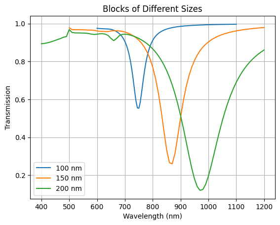
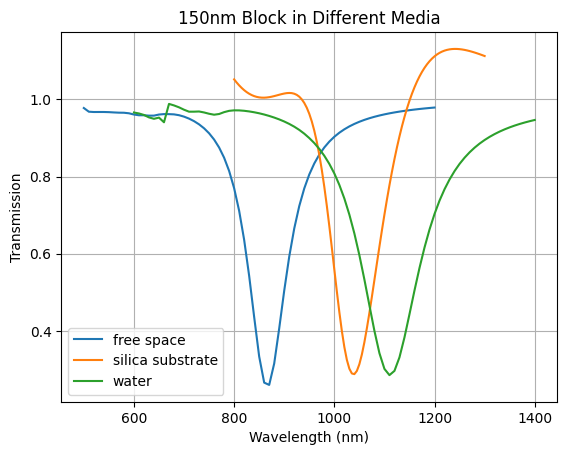

# Plasmon Resonance in Gold Metasurfaces (COMSOL Study)

Simulation-based study of plasmon resonance in periodic gold nanostructures, analyzing the effect of size, surrounding medium, and geometry using COMSOL Multiphysics.

---

## Key Insight
Environmental refractive index produces a **larger resonance shift (~242 nm)** than size variation (~225 nm), highlighting strong dielectric sensitivity of plasmonic metasurfaces.

---

## Overview
- System: Periodic array of gold nanostructures (metasurface)  
- Goal: Study how resonance wavelength changes with:
  - Element size  
  - Surrounding medium  
  - Geometry  
- Output: Transmittance vs wavelength  

---

## Methodology
- Software: COMSOL Multiphysics (Wave Optics Module)  
- Boundary Conditions:
  - Periodic (lateral directions → infinite array behavior)  
  - Perfectly Matched Layers (PML)  
- Excitation: Linearly polarized plane wave (normal incidence)  

### Parameters
- Diameter: 100 nm, 150 nm, 200 nm  
- Height: 10 nm  
- Environments:
  - Air (n = 1.0)  
  - SiO₂ substrate  
  - Water (n = 1.33)  

---

## Results

### 1. Size Dependence


- Resonance shifts from **748 nm → 973 nm**  
- Increase in FWHM with size → higher radiative damping  
- Cause: Larger effective electron oscillation length  

---

### 2. Environmental Effect


- Resonance shifts from **866 nm → 1108 nm**  
- Strong dependence on refractive index  
- Substrate shows intermediate behavior  

---

### 3. Geometry Dependence


- Sphere → ~550 nm  
- Ring → ~690 nm  
- Disk → ~770 nm  
- Block → ~860 nm  

- Edge effects and field localization influence resonance  

---

## Physics
Plasmon resonance approximately follows:

Re(εₘ) = −2ε_d  

- Increase in surrounding dielectric constant → redshift  
- Consistent with classical plasmonic theory  

---

## Tools Used
- COMSOL Multiphysics  
- Electromagnetic Simulation (Wave Optics)  
- Plasmonics  

---

## Repository Structure## Repository Structure
```
.
├── README.md
├── report/
│   └── technical_report.pdf
├── figures/
│   ├── size_dependence.png
│   ├── environment_dependence.png
│   └── geometry_dependence.png
```
---

## Key Takeaway
Plasmon resonance in gold metasurfaces is strongly influenced by **environment, size, and geometry**, with environmental effects playing a dominant role in spectral tuning.

---

## Possible Future Extensions
-  RI sensing applications
-  Surface Lattice Resonances
-  Angle and Polarization Dependence
-  Material Optimisation 

---

## Author
Arjun K U  
arjun777ku@gmail.com
